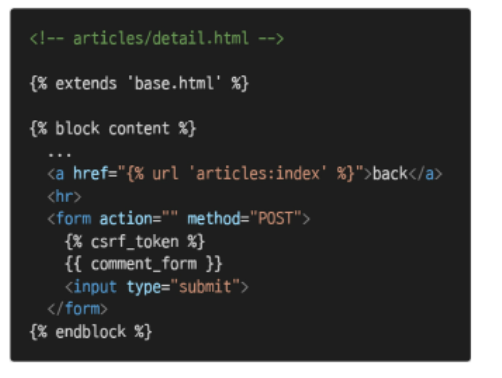

# Model Relationship 1

## Foreign Key


- A Many-to-one relationship
- 2개의 인자가 반드시 필요
  - 참조하는 model class  ex(Article)

- migrate 하게 되면 필드이름 + '_id' 가 추가 되어 데이터베이스 열 이름을 만듦


```python
from django.db import models
from django.conf import settings

class Comment(models.Model):
    article = models.ForeignKey(Article, on_delete=models.CASCADE)
    user = models.ForeignKey(settings.AUTH_USER_MODEL, on_delete=models.CASCADE)
    content = models.CharField(max_length=200)
    created_at = models.DateTimeField(auto_now_add=True)
    updated_at = models.DateTimeField(auto_now=True)

    def __str__(self):
        return self.content
```


## admin site 에서 댓글 확인하는 법


## 참조 / 역참조 in 1 : N 관계

 


## Comment Create

```python
from .models import Article, Comment

class CommentForm(forms.ModelForm):

    class Meta:
        model = Comment
        fields = ('content',)
```

### detail 페이지에서 출력

```python
# articles/views.py
from .forms import ArticleForm, CommentForm

@require_safe
def detail(request, pk):
    article = get_object_or_404(Article, pk=pk)
    comment_form = CommentForm()
    # 조회한 article의 모든 댓글을 조회(역참조)
    comments = article.comment_set.all()
    context = {
        'article': article,
        'comment_form': comment_form,
        'comments': comments,
    }
    return render(request, 'articles/detail.html', context)
```



### 댓글 작성 로직


- 여기서 save(commit=False) 로 댓글 객체 저장 후 누락되었던 article 을 할당해준 후 다시 저장

- 너 이글 몇 번 글에 쓸거야? == 외래 키 article_id 가 지금 없잖아

- 기본 commit = True 

  


## Comment Read

```python
# articles/views.py

@require_safe
def detail(request, pk):
    article = get_object_or_404(Article, pk=pk)
    comment_form = CommentForm()
    # 조회한 article의 모든 댓글을 조회(역참조)
    comments = article.comment_set.all()
    context = {
        'article': article,
        'comment_form': comment_form,
        'comments': comments,
    }
    return render(request, 'articles/detail.html', context)
```


```python
# articles/detail.html
<h4>댓글 목록</h4>
  <ul>
    
      <li>
        {{ comment.user }} - {{ comment.content }}
        
          <form action="" method = "POST">
            
            <input type="submit" value="삭제">
          </form>
        
      </li>
    
  </ul>
```


## Comment Delete


