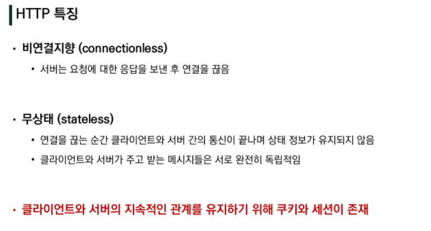
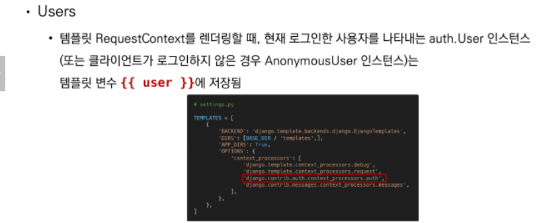
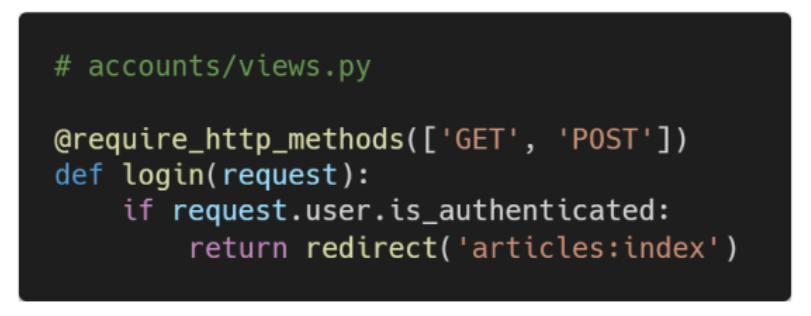

# 0411 django 정리 (accounts)

views.py 임포트 요약 공부...

```python
from django.contrib.auth import login as auth_login
from django.contrib.auth import logout as auth_logout
from django.contrib.auth import update_session_auth_hash
from django.contrib.auth.decorators import login_required
from django.contrib.auth.forms import (AuthenticationForm, PasswordChangeForm, UserCreationForm)
from django.shortcuts import redirect, render
from django.views.decorators.http import require_http_methods, require_POST
from .forms import CustomUserChangeForm

```


## Django authentication system 1

```django
settings.py / INSTALLED_APPS 에 포함되어 제공된다.
- django.contrib.auth
- django.contrib.contenttypes
```

인증(Authentication) + 권한(Authorization) = 인증시스템 (authentication system)

- 인증(Authentication)
  - 신원 확인
  - 사용자(user)가 자신이 누구인지 확인하는 것
- 권한(Authorization)
  - 권한 부여
  - 인증된 사용자(user)가 수행할 수 있는 작업을 결정
  - 

```python
$ python manage.py startapp accounts
```

- app 이름은 accounts 로 하는 것을 권장


## 쿠키와 세션



###  쿠키의 개념

- 서버가 사용자의 웹 브라우저에 전송하는 작은 데이터 조각
- 사용자가 웹사이트를 방문할 경우 해당 사이트의 서버를 통해 사용자의 컴퓨터에 설치되는 작은 기록 정보 파일
  - 브라우저(클라이언트)는 쿠키를 로컬에 KEY-VALUE의 데이터 형식으로 저장
  - 이렇게 쿠키를 저장해 놓았다가, 동일한 서버에 재 요청 시 저장 된 쿠키를 함께 전송

- HTTP 쿠키는 상태가 있는 세션을 만들어 줌
- 쿠키는 두 요청이 동일한 브라우저에서 들어왔는지 아닌지를 판단할 때 주로 사용
  - 이를 이용해 사용자의 로그인 상태를 유지할 수 있음
  - 상태가 없는(stateless) HTTP 프로토골에서 상태 정보를 기억 시켜주기 때문

> __웹 페이지에 접속하면 요청한 웹 페이지를 받으며 쿠키를 저장하고 클라이언트가 같은 서버에 재 요청 시 요청과 함께 쿠키도 함께 전송__

### 요청과 응답


### 쿠키의 사용 목적

1. 세션 관리
   - 로그인, 아이디 자동완성, 공지 하루 안보기, 팝업 체크, 장바구니 등
2.  개인화
3. 트래킹


> 개발자 도구 => Network Tap or Application


### 세션(session)

- 사이트와 특정 브라우저 사이의 '상태(state)'를 유지시키는 것
- 클라이언트가 서버에 접속하면 서버가 특정 __session id__ 를 발급, 클라이언트는 발급 받은 id 를 쿠키에 저장 
  - 클라이언트가 다시 서버에 접속하면 요청과 함께 쿠키를 서버에 전달
  - 쿠키는 요청 때마다 서버에 함께 전송되므로 서버에서 id 를 확인해 처리
- ID 는 세션을 구분하기 위해 필요하며 쿠키에는 ID만 저장함


### 쿠키 lifetime


### Session in django


## 로그인(login)

- create의 로직과 같음 => session 을 create 한다고 생각하면 됨
- 인증에 관한 built-in forms 제공


### AuthenticationForm

- login을 위한 form
- request 가 첫번째 인자


```python
from django.contrib.auth import AuthenticationForm
from django.contrib.auth import login as auth_login

def login(request):
    if request.user.is_authenticated:
        return redirect('articles:index')

    if request.method == 'POST':
        form = AuthenticationForm(request, request.POST)
        if form.is_valid():
            auth_login(request, form.get_user())
            return redirect(request.GET.get('next') or'articles:index')
    else:
        form = AuthenticationForm()
        context = {
            'form' : form
        }
    return render(request, 'accounts/login.html', context)
```

- 로그인 함수의 이름을 auth_login 으로 변경

### 현재 로그인 되어 있는 유저 정보 출력





## 로그아웃(logout)

- Session 을 Delete 하는 로직과 같더라


```python
from django.contrib.auth import logout as auth_logout

@require_POST
def logout(request):
    if request.user.is_authenticated:
        auth_logout(request)
    return redirect('articles:index')
```


## 로그인 사용자 접근 제한 = 로그인 했는지 안했는지

### 2가지 방법

1. the raw way
   - __is_authenticated__ attribute
2. the __login_decorated__ decorator

#### is_authenticated

- 로그인과 비로그인 상태에서 출력되는 링크를 다르게 설정


- 인증된 사용자(로그인 상태)라면 로그인 로직을 못하게 처리



- 인증된 사용자만 게시글 작성 링크를 볼 수 있도록 처리


#### login_required decorator


### decorator 충돌로 인한 구조적 문제


## Django authentication system 2

### 회원가입(Signup)

- __UserCreationForm()__  ==> CustomUserCreationForm()

  

```python
from django.contrib.auth.forms import UserCreationForm
from django.contrib.auth import login as auth_login

@require_http_methods(['GET', 'POST'])
def signup(request):
    if request.user.is_authenticated:
        return redirect('articles:index')

    if request.method == 'POST':
        form = CustomUserCreationForm(request.POST)
        if form.is_valid():
            user = form.save()
            auth_login(request, user)
            return redirect('articles:index')
    else:
        form = CustomUserCreationForm()
    context = {
        'form': form,
    }
    return render(request, 'accounts/signup.html', context)
```


### 회원탈퇴


```python
from django.contrib.auth import logout as auth_logout

@require_POST
def logout(request):
    if request.user.is_authenticated:
        request.user.delete()
        auth_logout(request)
    return redirect('articles:index')
```


### 회원정보수정


```python
from django.contrib.auth.forms import UserChangeForm, UserCreationForm
from django.contrib.auth import get_user_model

class CustomUserChangeForm(UserChangeForm):

    # password = None

    class Meta:
        model = get_user_model() # User
        fields = ('email', 'first_name', 'last_name',)
```


### 비밀번호 변경


```python
from django.contrib.auth.forms import PasswordChangeForm

@login_required
@require_http_methods(['GET', 'POST'])
def change_password(request):
    if request.method == 'POST':
        form = PasswordChangeForm(request.user, request.POST)
        if form.is_valid():
            # user = form.save()
            # update_session_auth_hash(request, user)
            form.save()
            update_session_auth_hash(request, form.user)
            return redirect('articles:index')
    else:
        form = PasswordChangeForm(request.user)
    context = {
        'form': form,
    }
    return render(request, 'accounts/change_password.html', context)
```

