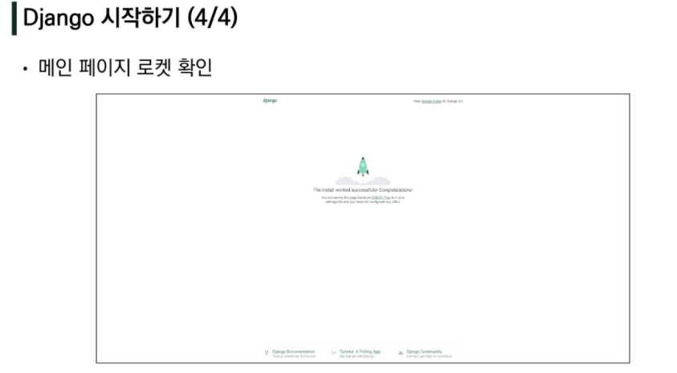
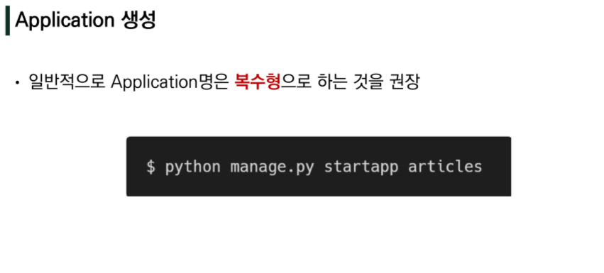

# Django


## Framework Architecture

- Django는 MTV Pattern
  - MTV(model-view-controller) 가 아닌 MTV(model-template-view) 가 맞다고 생각한다.

- Model
  - 응용프로그램의 데이터 구조를 정의하고 데이터베잇의 기록을 관리
- Template(view)
  - 파일의 구조나 레이아웃을 정의
  - 실제 내용을 보여주는 데 사용
- View
  - HTTP 요청을 수신하고HTTP 응답을 반환
  - Model을 통해 요청을 충족시키는데 필요한 데이터에 접근
  - Template에게 응답의 서식 설정을 맡김


## MTV Pattern


# 장고 시작하기

```python
python -m venv venv

source venv/Scripts/activate

ctrl + shift + p -> interpreter -> venv 로 고르기

pip list

pip install -r requirements.txt

django==3.2.12 설치

ipython + django_extensions

django_bootstrap5
```





## Application은 생성 후 등록!!




## 앱 등록시 주의 사항


