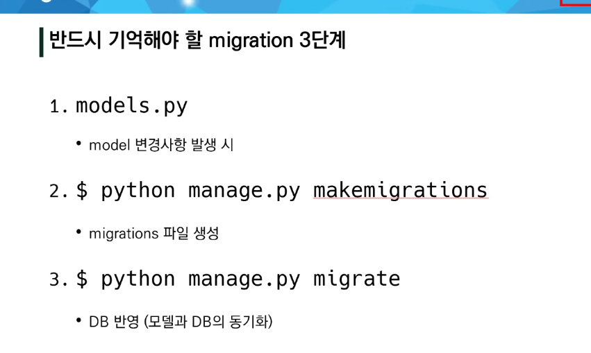

# django 2

## models.py


```python
python manage.py makemigrations
python manage.py migrate
python manage.py sqlmigrate app_name 0001

```




## models 수정 후


## DataBase API


## CRUD (Create, Read, Update, Delete)


##  Admin Site


