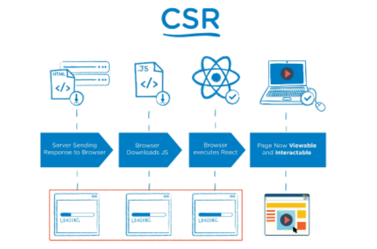
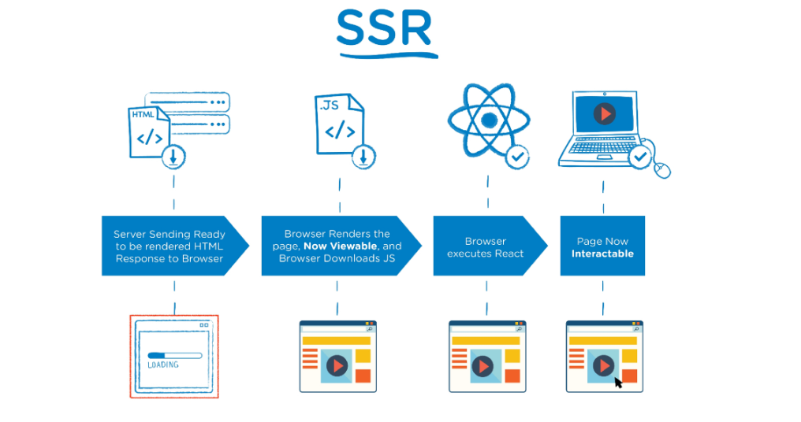
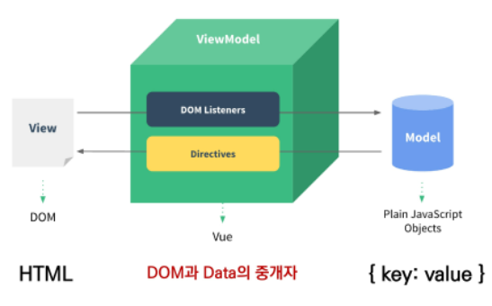
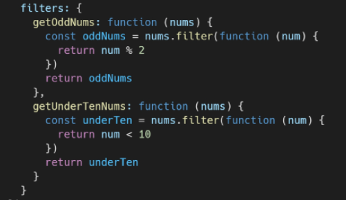
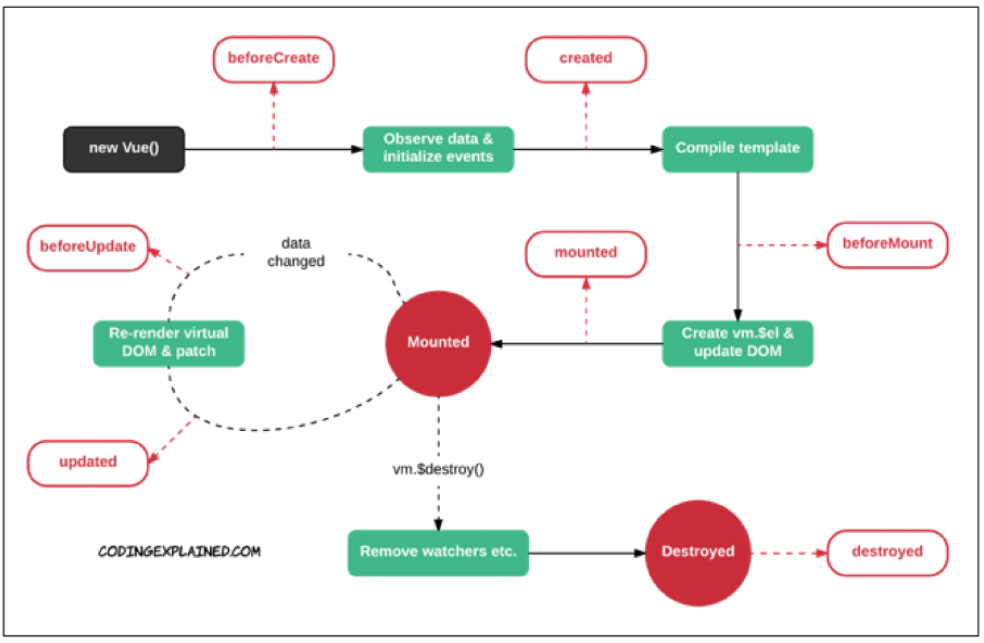

# Vue.js_01

## Intro

- Front-End Development
- 사용자 인터페이스를 만들기 위한 진보적인 자바스크립트 프레임워크
- 현대적인 tool 과 다양한 라이브러리를 통해 SPA(Single Page Application)을 완벽하게 지원
- Evan You에 의해 발표(2014)

### SPA

- Single Page Application 
- 현재 페이지를 동적으로 렌더링함으로써 사용자와 소통하는 웹 애플리케이션
- 단일 페이지로 구성되며 서버로부터 최총에만 페이지를 다운로드하고 이후에는 동적으로 DOM을 구성
  - 처음 페이지를 받은 이후부터는 서버로부터 새로운 전체 페이지를 불러오는 것이 아닌, 현재 페이지 중 필요한 부분만 동적으로 다시 작성함
- 연속되는 페이지 간의 사용자 경험(UX)을 향상
  - 모바일 사용량이 증가하고 있는 현재 트래픽의 감소와 속도, 사용성, 반응성의 향상은 매우 중요하기 때문
- 동작 원리의 일부가 CSR(Client Side Rendering)의 구조를 따름

SPA 등장 배경

- 과거 웹 사이트들은 요청에 따라 매번 새로운 페이지를 응답하는 방식
  - MPA (Multi Page Application)
- 스마트폰이 등장하면서 모바일 최적화의 필요성이 대두됨
  - 모바일 네이티브 앱과 같은 형태의 웹 페이지가 필요해짐
- 이러한 문제를 해결하기 위해 Vue.js와 같은 프론트엔드 프레임워크가 등장
  - CSR, SPA의 등장
- 1개의 웹 페이지에서 여러 동작이 이루어지며 모바일 앱과 비슷한 형태의 사용자 경험을 제공

### CSR

- Client Side Rendering
- 서버에서 화면을 구성하는 SSR 방식과 달리 클라이언트에서 화면을 구성
- 최초 요청 시 HTML, CSS, JS 등 데이터를 제외한 각종 리소스를 응답받고 이후 클라이언트는 필요한 데이터만 요청해 JS로 DOM을 렌더링하는 방식
- 즉, 처음엔 뼈대만 받고 브라우저에서 동적으로 DOM을 그림
- SPA가 사용하는 렌더링 방식



> 장점

1. 서버와 클라이언트 간 트래픽 감소
   - 필요한 모든 정적 리소스 최초 1회 다운로드 후 필요 데이터만 갱신
2.  사용자 경험(UX) 향상
   - 변경되는 부분만 갱신하여 렌더링하기 때문

> 단점

1. SSR에 비해 전체 페이지 최종 렌더링 시점이 느림
2.  SEO(검색 엔진 최적화)에 어려움이 있음 (최초 문서에 데이터 마크업이 없기 때문에)

### SSR

- Server side Rendering
- 서버에서 클라이언트에게 보여줄 페이지를 모두 구성하여 전달하는 방식
- JS 웹 프레임워크 이전에 사용되던 전통적인 렌더링 방식



> 장점

1. 초기 구동 속도가 빠름
   - 클라이언트가 빠르게 컨텐츠를 볼 수 있음
2. SEO에 적합
   - DOM에 이미 모든 데이터가 작성되어있기 때문

> 단점

1. 모든 요청마다 새로운 페이지를 구성하여 전달
   - 반복되는 전체 새로고침으로 인해 사용자 경험이 떨어짐
   - 상대적으로 트래픽이 많아 서버의 부담이 클 수 있음

### SSR / CSR

- 두 방식의 차이는 최종 HTML 생성 주체가 누구인가에 따라 결정
- 즉, 실제 브라우저에 그려질 HTML을 서버가 만들면 SSR / 클라이언트가 만들면 CSR

- 서비스 또는 프로젝트 구성에 맞는 방법을 적절하게 선택하는 것이 중요

### [참고] SEO

> [참고] SEO

- Search Engine Optimization
- 웹 페이지 검색엔진이 자료를 수집하고 순위를 매기는 방식에 맞게 웹 페이지를 구성해서 검색 결과의 상위에 노출될 수 있도록 하는 작업
- 인터넷 마케팅 방법 중 하나
- 구글의 등장 이후 검색엔진들이 컨텐츠의 신뢰도를 파악하는 기초 지표로 사용됨
  - 다른 웹 사이트에서 얼마나 인용되었나를 반영
  - 결국 타 사이트에 인용되는 횟수를 늘리는 방향으로 최적화

> [참고] SEO 대응

- Vue.js 또는 React 등의 SPA 프레임워크는 SSR을 지원하는 SEO 대응 기술이 이미 존재
  - SEO 대응이 필요한 페이지에 대해서는 선별적 SEO 대응 가능
- 혹은 추가로 별도의 프레임워크를 사용하기도 함
  - Nuxt.js
    - Vue.js 응용 프로그램을 만들기 위한 프레임워크
    - SSR 지원
  - Next.js
    - React 응용 프로그램을 만들기 위한 프레임워크
    - SSR 지원


## WHY Vue.js

- 가장 인기있는 프론트엔드 프레임워크

> 왜 사용할까?

- 현대 웹 페이지는 페이지 규모가 계속해서 커지고 있으며, 그만큼 사용하는 데이터도 늘어나고 사용자와의 상호작용도 많이 이루어짐
- 결국 Vanilla JS 만으로는 관리가 어려움
  - 예시) "페이스북 친구가 이름을 수정했을 경우, 화면상에서 변경되어야 하는 것들"
    - 타임라인의 이름, 페이스북 메시지 상의 이름, 내 주소록에서의 친구 이름 등
    - => 페이스북이 React를 개발한 이유

> 비교

- Vanilla JS
  - 한 유저가 작성한 게시글이 DOM상에 100개 존재
  - 이 유저가 닉네임을 변경하면, DB의 Update와 별도로 DOM상의 100개의 작성자 이름이 모두 수정되어야 함
  - `모든 요소`를 선택해서 `이벤트`를 등록하고 값을 변경해야 함
- Vue.js
  - DOM과 Data가 연결되어 있고
  - Data를 변경하면 이에 연결된 DOM은 알아서 변경
  - 즉, 우리가 신경쓸 것은 오직 __<u>Data에 대한 관리 (Developer Exp 향상)</u>__


## Concepts of Vue.js

## MVVM Pattern

- 애플리케이션 로직을 UI로부터 분리하기 위한 설계된 디자인 패턴
- 구성 요소
  - model
  - view
  - view model



> **Model**

- Vue에서 **Model** 은 JavaScript Object 이다.

- ```
  Object === {key: value}
  ```

- Model은 은 Vue Instance 내부에서 **data **라는 이름으로 존재

- data가 바뀌면 View(DOM)가 반응

> **View**

- Vue에서 **View는** DOM(**HTML**) 이다.
- Data의 변화에 따라서 바뀌는 대상

>**ViewModel**

- Vue에서 **ViewModel**은 모든 Vue Instance 이다.
- View와 Model 사이에서 Data와 DOM에 관련된 모든 일을 처리
- ViewModel을 활용해 Data를 얼마나 잘 처리해서 보여줄 것인지(DOM)를 고민하는 것


## Vue version. 2 vs 3

> Vue 3

- 2022년 2월부터 Vue.js의 기본 버전이 3.x 로 전환
- CDN or npm을 통한 설치시 자동으로 Vue 3로 설정

> Vue 2

- 실무에서 여전히 Vue.js 2가 많이 사용됨 (legacy code)
- Vue 2의 생태계(문서, 튜토리얼, 자료, QnA 등)가 더 성숙함
- 코어/커뮤니티 라이브러리의 호환 역시 Vue.js 2가 더 안정적
- **참고자료가 많은 Vue.js 2로 학습 후, Vue 3로 이전(migration)하는게 가장 효과적**


## Quick Start of Vue.js


## Basic Syntax of Vue.js

> Vue instance

- 모든 Vue앱은 Vue 함수로 새 인스턴스를 만드는 것부터 시작
- Vue 인스턴스를 생성할 때는 Options 객체를 전달해야 함
- 여러 Options들을 사용하여 원하는 동작을 구현
- Vue instance === Vue Component

```js
const app = new Vue({

})
```

> Options/DOM - 'el'

- Vue 인스턴스에 연결(마운트)할 기존 DOM 요소가 필요
- CSS 선택자 문자열 혹은 HTML Element로 작성
- new를 이용한 인스턴스 생성 때만 사용

```js
const app = new Vue({
    el: '#app'
})
```

> Options/DOM - 'data'

- Vue 인스턴스의 데이터 객체
- Vue 인스턴스의 상태 데이터를 정의하는 곳
- Vue template에서 interpolation을 통해 접근가능
- v-bind, v-on과 같은 directive에서도 사용 가능
- Vue 객체 내 다른 함수에서 this 키워드를 통해 접근 가능

```js
const app = new Vue({
    el: '#app',
    data: {
        message: 'Hello',
    }
})
```

> Options/Data - 'methods'

- Vue 인스턴스에 추가할 메서드
- Vue template에서 interpolation을 통해 접근 가능
- v-on과 같은 directive에서도 사용 가능
- Vue 객체 내 다른 함수에서 this 키워드를 통해 접근 가능
- 주의
  - **화살표 함수를 메서드를 정의하는 데 사용하면 안됨**
  - 화살표 함수가 부모 컨텍스트를 바인딩하기 때문에, this 는 Vue 인스턴스가 아님

```js
const app = new Vue({
    el: '#app',
    data: {
        message: 'Hello',
    },
    methods: {
        greeting: function () {
            console.log('hello')
        }
    }
})
```

> 화살표 함수를 사용하면 안되는 경우

1. data
2. method 정의


## Template Syntax

> Interpolation (보간법)

1.   Text
     -   `<span>{{ msg }}</span>`
2.   Raw HTML
     -   `<span v-html="rawHtml"></span>`
3.   Attributes
     -   `<div v-bind:id="dynamicId"></div>`
4.   JS 표현식
     -   `{{ number + 1}}`
     -   `{{ message.split('').reverse().join('') }}`

> Directive (디렉티브)

- v- 접두사가 있는 특수 속성

- 속성 값은 단일 JS 표현식이 됨 (v-for 예외)

- 표현식의 값이 변경 될 때 반응적으로 DOM에 적용하는 역할을 함

- **전달인자 (Arguements)**

  - `:`(콜론)을 통해 전달인자를 받을 수 있음

  ```html
  <a v-bind:href="url"> ... </a>
  <a v-on:click="doSomething"> ... </a>
  ```

  - **수식어 (Modifiers)**

    - `.`으로 표시되는 특수 접미사
    - Directive를 특별한 방법으로 바인딩해야 함을 나타냄

    ```html
    <form v-on:submit.prevent="onSubmit">
        ...
    </form>
    ```

> v-text

- 엘리먼트의 textContent를 업데이트
- 내부적으로 interpolation 문법이 v-text로 컴파일 됨

> v-html

- 엘리먼트의 innerHTML을 업데이트
  - XSS 공격에 취약할 수 있음
- 임의로 사용자로부터 입력 받은 내용은 v-html에 **<u>사용 절대 금지</u>**

> v-show와 v-if

- - CSS display속성을 hidden으로 만들어 토글
  - 실제로 렌더링은 되지만 눈에서 보이지 않는 것이기 때문에 딱 한 번만 렌더링이 되는 경우라면 `v-if`에 비해 상대적으로 렌더링 비용이 높음
  - 하지만, 자주 변경되는 요소라면 한 번 렌더링 된 이후부터는 보여주는지에 대한 여부만 판단하면 되기 때문에 토글 비용이 적음
- v-if (Cheap initial load, expensive toggle)
  - 전달인자가 false 인 경우 렌더링 되지 않음
  - 화면에서 보이지 않을 뿐만 아니라 렌더링 자체가 되지 않기 때문에 렌더링 비용이 낮음
  - 하지만, 자주 변경되는 요소의 경우 다시 렌더링 해야 하므로 비용이 증가할 수 있음

> v-for

- 원본 데이터를 기반으로 엘리먼트 또는 템플릿 블록을 여러 번 렌더링
- item in itmes 구문 사용
- item 위치의 변수를 각 요소에서 사용할 수 있음
  - 객체의 경우는 key
- **v-for 사용시 반드시 key 속성을 각 요소에 작성**

> Options/Data - 'computed'

- 데이터를 기반으로 하는 계산된 속성
- 함수의 형태로 정의하지만 함수가 아닌 **함수의 반환 값이** 바인딩 됨
- 종속된 데이터에 따라 저장(캐싱)됨
- <u>**종속된 데이터가 변경될 때만 함수를 실행**</u>
- 즉, **어떤 데이터에도 의존하지 않는 computed 속성의** 경우 절대로 업데이트되지 않음
- **반드시 반환 값이 있어야 함 ** RETURN!!!

> computed & methods

- computed 속성 대신 methods에 함수를 정의할 수도 있음
  - 최종 결과에 대해 두 가지 접근 방식은 서로 동일
- 차이점은 computed 속성은 종속 대상을 따라 캐싱됨
- **즉, computed는 종속된 대상이 변경되지 않는 한 computed에 작성된 함수를 여러 번 호출해도 계산을 다시 하지 않고 계산되어 있던 결과를 반환**
- 이에 비해 methods를 호출하면 렌더링을 다시 할 때마다 항상 함수를 실행

> computed & watch

- computed
  - 특정 데이터를 직접적으로 사용/가공하여 다른 값으로 만들 때 사용
  - 속성은 계산해야 하는 목표 데이터를 정의하는 방식
  - **선언형 프로그래밍**  : <u>계산해야하는 목표 데이터를 정의</u>
  - "특정 값이 변동하면 해당 값을 다시 계산해서 보여준다."
- watch
  - 특정 데이터의 변화 상황에 맞춰 다른 data 등이 바뀌어야 할 때 주로 사용
  - 감시할 데이터를 지정하고 그 데이터가 바뀌면 특정 함수를 실행하는 방식
  - **명령형 프로그래밍**  : 데이터가 바뀌면 특정 함수를 실행해!" 
  - "특정 값이 변동하면 다른 작업을 한다."
  - 특정 대상이 변경되었을 때 콜백 함수를 실행시키기 위한 트리거

- computed 와 watch는 어떤 것이 더 우수한 것이 아닌 사용하는 목적과 상황이 다름

> Options/Assets - `filter`

- 텍스트 형식화를 적용할 수 있는 필터
- interpolation 혹은 v-bind를 이용할 때 사용 가능
- 필터는 자바스크립트 표현식 마지막에 `|`와 함께 추가되어야 함
- 이어서 사용(chaining) 가능




## LifeCycle Hooks

- 각 Vue 인스턴스는 생성될 때 일련의 초기화 단계를 거침
  - 예를 들어 데이터 관찰 설정이 필요한 경우, 인스턴스를 DOM에 마운트하는 경우, 데이터가 변경되어 DOM을 업데이트하는 경우 등
- 그 과정에서 사용자 정의 로직을 실행할 수 있는 Lifecycle Hooks도 호출됨
- [공식문서 ](https://kr.vuejs.org/v2/guide/instance.html#인스턴스-라이프사이클-훅)의 각 훅의 상세동작  참고

- created를 사용해 애플리케이션의 초기 데이터를 API 요청으로 불러올 수 있음



