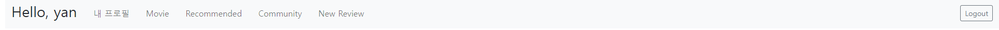
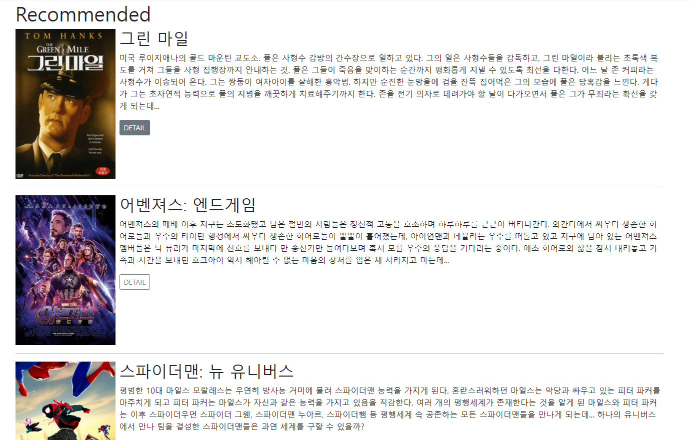
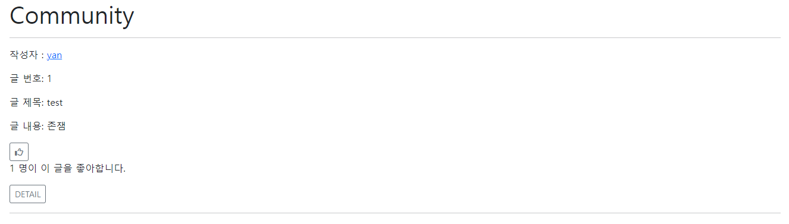
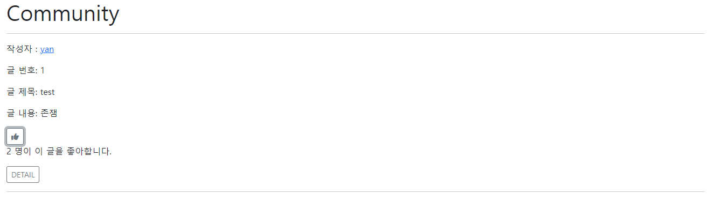
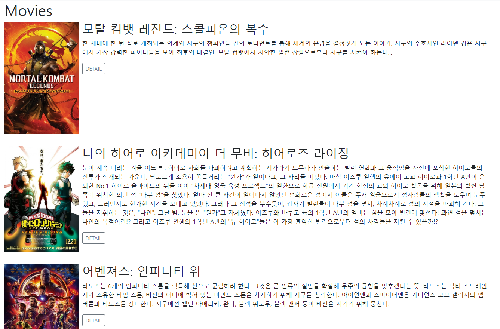

# pjt09 알고리즘을 적용한 서버 구성

:panda_face: : *written by* **안현모**

:penguin: : *written by* **한승재**


## :panda_face: [ADD] follow

- Ajax 통신을 이용하여 팔로우 버튼과 좋아요 버튼을 구현

- 서버에서 Json 데이터를 받아와 html 을 구성

    - id 부여

    - queryselect

    - `followForm` 내에 `eventlistener`, `axios`, `then`, `catch` 작성

    ```javascript
    followForm.addEventListener('submit', function (event) {
      event.preventDefault()
      axios({
        method: 'post',
        url: requestUrl,
        headers: {
          'x-csrftoken': csrfToken
        }
      })
        .then(res => {
          if (res.data.isFollow) {followBtn.innerText = '언팔로우'}
          else {followBtn.innerText = '팔로우'}
          followingText.innerText = res.data.followingCount
          followerText.innerText = res.data.followerCount
        })
        .catch(err => console.error(err))
    })
    ```

    ​    

## :penguin: [ADD] Movies & Recommendation

-   `movies app`의 `index`와 `detail` templates와 view 작성했습니다.

-   영화 추천을 해주기 위해, movies DB에서 `vote_count`가 3000 이상, `popularity`가 30 이상인 영화 쿼리셋을 가져온 후, `random` 모듈을 이용해 그 중에서 10개를 뽑아 리스팅하도록 제작했습니다.

    ```python
    @require_safe
    @login_required
    def recommended(request):
        movies = list(Movie.objects.filter(vote_count__gte=3000, popularity__gte=30))
        recommend = random.sample(movies, 10)
    
        context = {
            'movies': recommend,
        }
    
        return render(request, 'movies/recommended.html', context)
    ```


## :penguin: [ADD] Bootstrap Style

-   `Navbar`를 디자인했습니다.

    

-   웹 페이지에 존재하는 버튼과 form에 모두 Bootstrap 스타일링을 적용시켰습니다.

    


## :penguin: [FIX] Like Button Toggle

-   `Fontawesome`을 이용해, 좋아요 버튼을 아이콘 토글되게 변경했습니다.

    

    


## :panda_face: [ADD] Infinite Scroll

- `index.html` 구성

    ```javascript
    document.addEventListener('scroll', function (event) {
        const { scrollTop, clientHeight, scrollHeight } = document.documentElement
        
        if (scrollTop + clientHeight >= scrollHeight - 7) {
          axios({
            ...
          })
            .then(res => {
              const movies = res.data
              movies.forEach(movie =>{  
                ...
                ...
                ...
                MovieDiv.append(h2, p, a, hr)
    
                movieList.appendChild(MovieDiv)
              })
    
              page++
            })
            .catch(res => console.error(err))
        }
      })
    ```

- `restframework`, `bootstrap5 `


## :penguin: [ADD] Movie Index Poster

-   페어인 현모님이 제작해주신 인피니티 스크롤이 적용되는 `movie index` 페이지에 영화 포스터가 출력되도록 수정했습니다.

    


## 후기

- :panda_face: 공부를 제대로 했었다면 좀 더 도움이 되었을텐데... 여지껏 관통 중 가장 도움이 안되었다ㅎㅎ
- :panda_face: **axios를 이용해 json 데이터를 받아오는** 이 부분 복습을 다시 해야겠다.
- :panda_face: 기본적인 기능을 구현한 후에도 부트스트랩을 적용하거나 styling을 하는 부분도 중요하다..
- :penguin: 지금까지 한 프로젝트 중에 가장 완성도있는 작품을 만든 것 같아서 좋았습니다!
- :penguin: **마지막에 시간없어서** 디스코드로 대화하면서 동시에 커밋했는데 지금까지 중 가장 재밌었습니다.