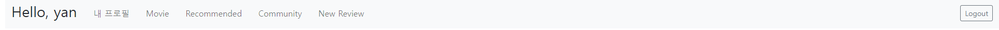
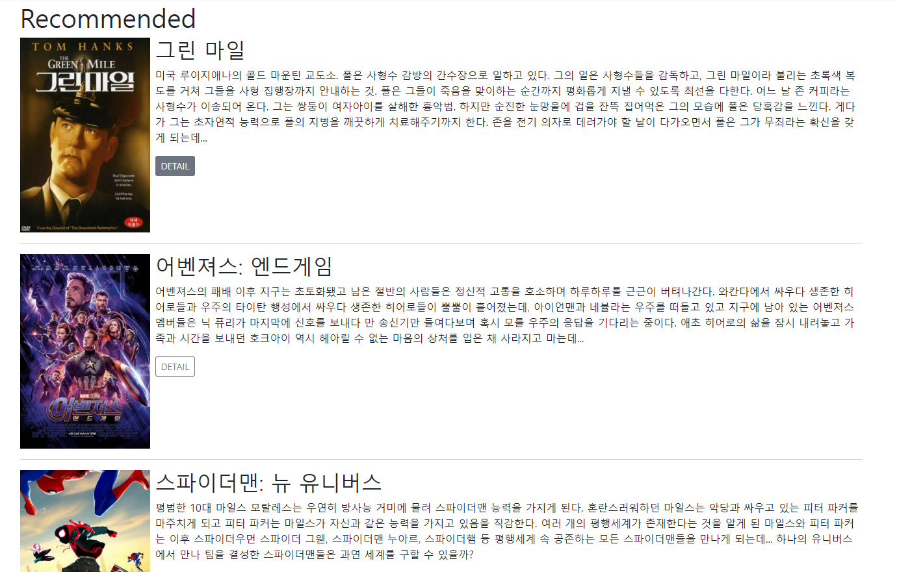
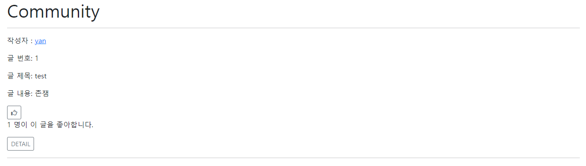
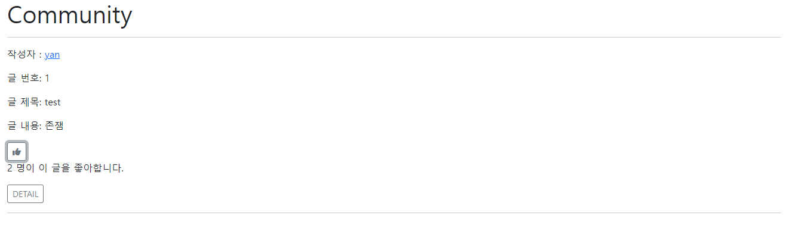
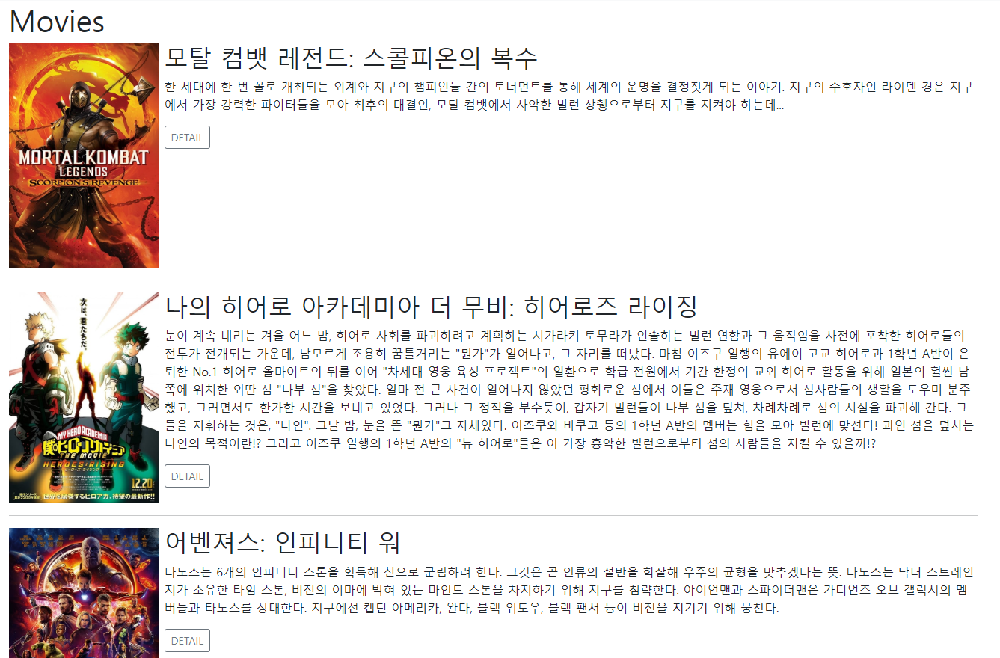

# pjt09 알고리즘을 적용한 서버 구성

## [ADD] Movies & Recommendation

-   `movies app`의 `index`와 `detail` templates와 view 작성했습니다.

-   영화 추천을 해주기 위해, movies DB에서 `vote_count`가 3000 이상, `popularity`가 30 이상인 영화 쿼리셋을 가져온 후, `random` 모듈을 이용해 그 중에서 10개를 뽑아 리스팅하도록 제작했습니다.

    ```python
    @require_safe
    @login_required
    def recommended(request):
        movies = list(Movie.objects.filter(vote_count__gte=3000, popularity__gte=30))
        recommend = random.sample(movies, 10)
    
        context = {
            'movies': recommend,
        }
    
        return render(request, 'movies/recommended.html', context)
    ```


## [ADD] Bootstrap Style

-   `Navbar`를 디자인했습니다.

    

-   웹 페이지에 존재하는 버튼과 form에 모두 Bootstrap 스타일링을 적용시켰습니다.

    


## [FIX] Like Button Toggle

-   `Fontawesome`을 이용해, 좋아요 버튼을 아이콘 토글되게 변경했습니다.

    

    


## [ADD] Movie Index Poster

-   페어인 현모님이 제작해주신 인피니티 스크롤이 적용되는 `movie index` 페이지에 영화 포스터가 출력되도록 수정했습니다.

    