# 220117 코딩 데이터&제어문

## ##기초문법

### 들여쓰기

### 변수

- 변수는 할당 연산자 (=)를 통해 값을 할당(assignment)

- type()

  - 변수에 할당된 값의 타입

- id()

  - 변수에 할당된 값(객체)의 고유한 아이덴티티(identity) 값이며, 메모리주소

  ```python
  x = 'ssafy'
  ```

  ```python
  type(x) str
  id(x) 
  ```

### 변수 할당

- 같은 값 동시에 할당 가능

- 다른 값을 다른 변수에 각각 한번에 할당 가능

- ```python
  x,y = 1,2
  ```

- x, y 할당 값 바꾸기. 

  - 1 ) tmp 임시변수 활용
  - 2 ) pythonic! y,x = x,y

### 식별자

- 파이썬 객체를 식별하는데 사용하는 이름(name)
- 규칙
  - 영문, 알파벳, 언더스코어, 숫자로 구성
  - 첫 글자에 숫자 불가능
  - 대소문자 구별
  - 예약어로 키워드를 사용할 수 없음
  - 내장함수, 모듈 등의 이름 불가능

## 파이썬 자료형

### 자료형 분류

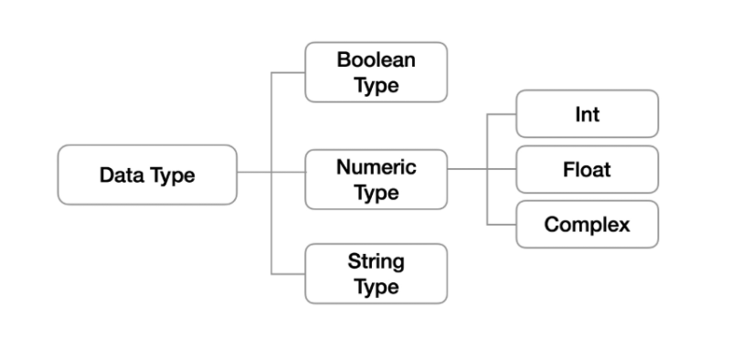

### none

### 불린형(Boolean Type)

- True / False 값

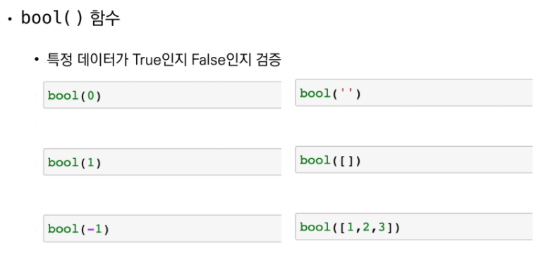

F F

T F

T T

bool([0]) true

### 수치형

- 모든 정수의 타입은 int
- 진수 표현 
  - 2진수 : 0b
  - 8진수 : 0o
  - 16진수 : 0x
- Float : 정수가 아닌 모든 실수는 float 타입

### 문자열

- String interpolation
- f -strings 

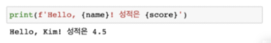

## 컨테이너

### 컨테이너 분류

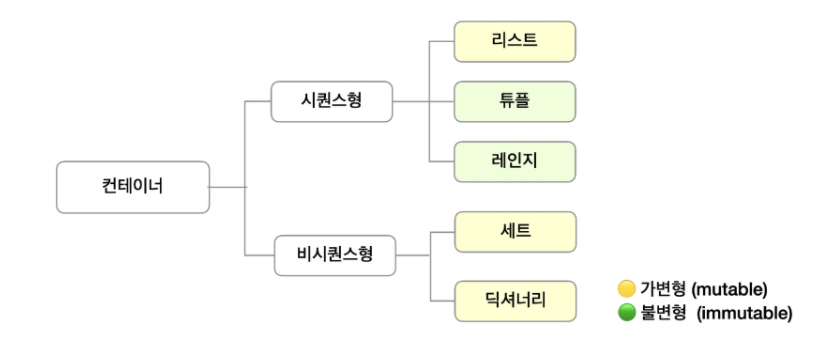

### 시퀀스형 분류

#### 리스트(List)

- 리스트는 대괄호 또는 list( ) 룰 통해 생성
- positive index : 0 부터 시작
- negative index : -1 로 끝남

- 예시를 통해 구분..

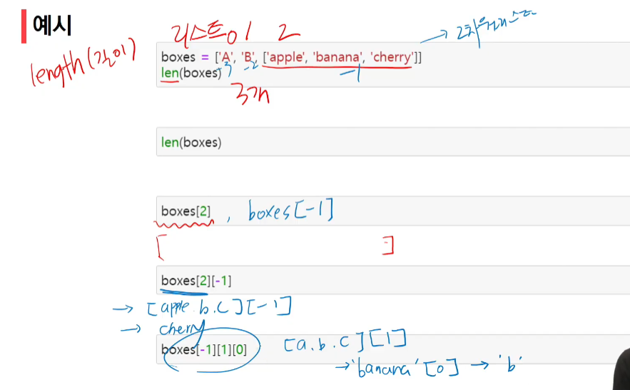

#### 튜플(tuple)

- 항상 소괄호 형태로 출력
- **immutable**

- 

#### 레인지(Range)

- 기본형 : range(n)
  - 0 부터 n-1 까지의 숫자의 시퀀스
- 범위 지정 : range( n, m )
  - n 부터 m-1 까지의 숫자 시퀀스
- range (n, m, s)
  - n 부터 m-1  까지 s만큼 증가시키는 숫자의 시퀀스

### 비시퀀스형 분류

#### 셋(set)\

- 집합과 동일한 구조를 가짐
- 중복된 값이 존재하지 않음
- 중괄호 ({ }) 혹은 set() 을 통해 생성
- 빈 Set 을 만드려면 set() 활용

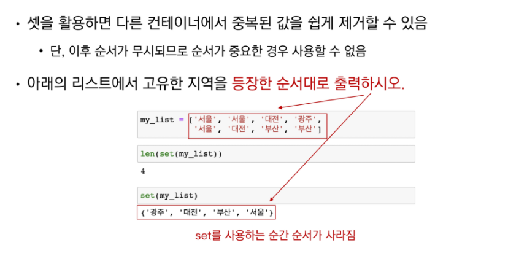

#### 딕셔너리(dictionary)

- 순서 없이 키-값 (key - value) 쌍으로 이뤄진 객체를 참조하는 자료형

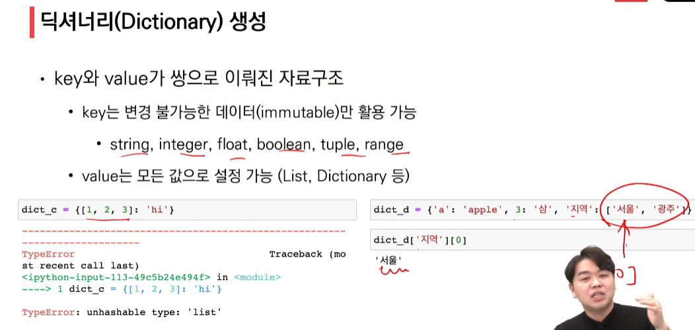


## 형 변환 (Typecasting)

### 암시적 형변환

### 명시적 형변환


## 연산자

### 산술연산자

### 비교연산자

### 논리연산자

#### 단축평가

- 결과가 확실한 경우 두 번째 값은 확인하지 않음.

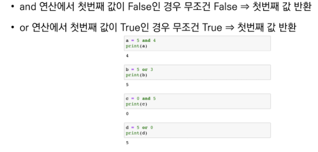

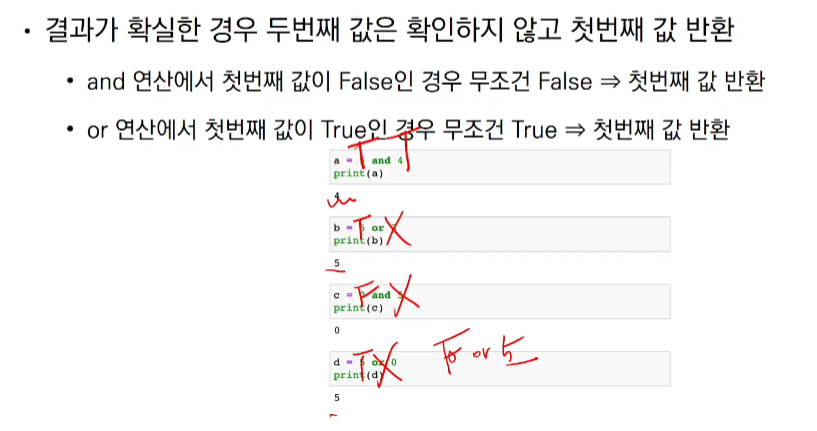

### 멤버십연산자

- 시퀀스 포함 여부 확인

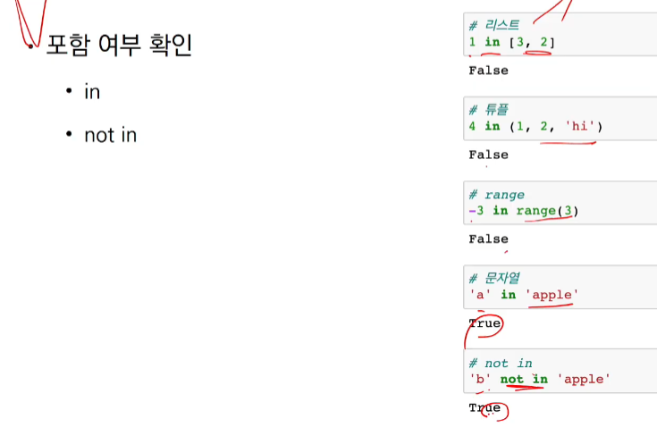

### 시퀀스형 연산자 

#### 산술연산자 (+)

#### 반복연산자

- 시퀀스를 반복

### 기타 :

#### 인덱싱 (Indexing)

- 시퀀스의 특정 인덱스 값에 접근
  - 해당 인덱스가 없는 경우에 IndexError

#### 슬라이싱 (Slicing)

- 시퀀스를 특정 단위로 슬라이싱

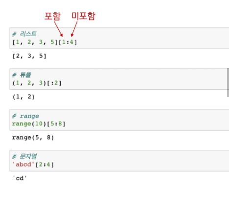


## ##제어문 (조건문, 반복문)

### 조건문

- 조건문은 참/거짓을 판단할 수 있는 조건식과 함께 사용

- 기본 형식

  - if, else 

- 실습문제

  - 홀수/짝수 판별할 때 나머지 연산 기호 ' %' 쓰게 될 것

- **input 으로 받는 것은 무조건 문자열 형식이라** 

  **int(input('숫자를 입력해주세요 : '))**

  **명시적 형전환을 해줘야 한다 int 사용.**


#### 조건표현식

- <참일 경우 값>  if <expression>  else <거짓일 경우 값>
- 

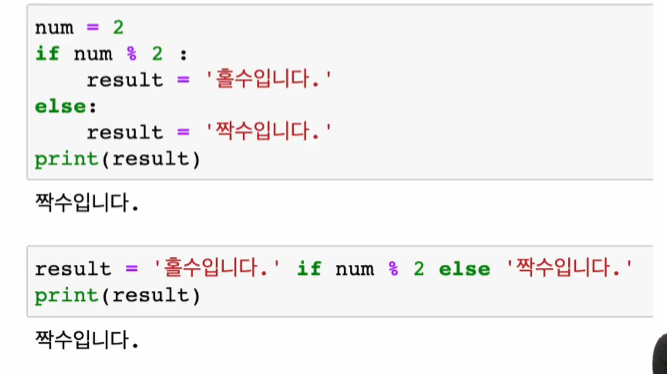

### 반복문

#### while 문

- while 문은 조건식이 참인 경우 반복적으로 

#### for 문

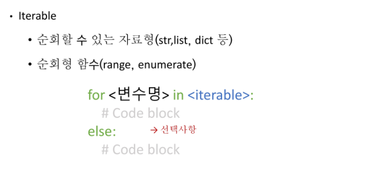

- 다른 표현식

  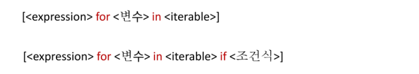

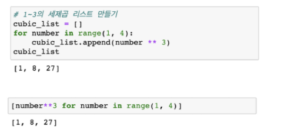

### 반복문 제어

#### break, continue, for else

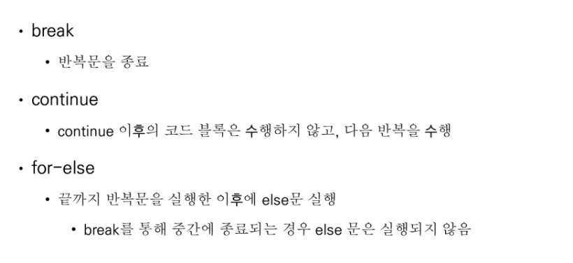

#### 반복문 제어 정리

- 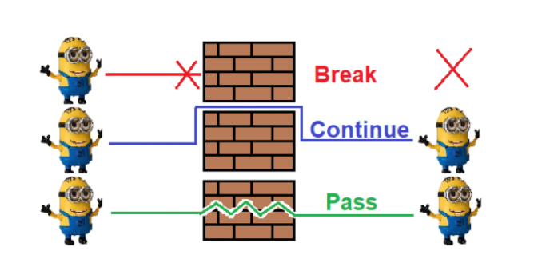